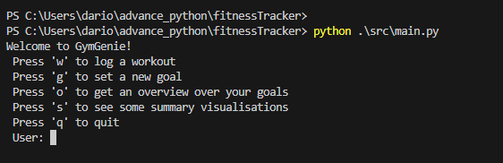
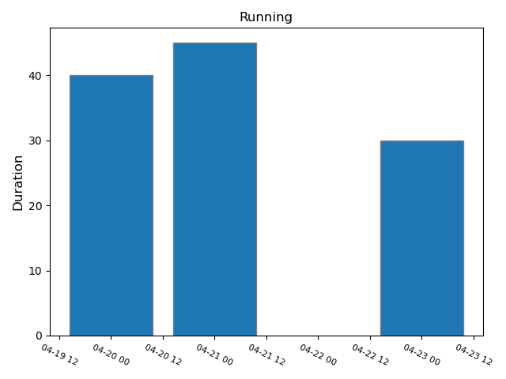
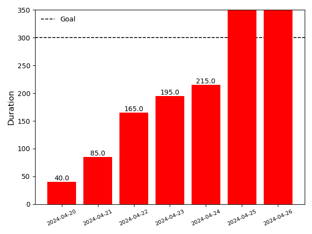
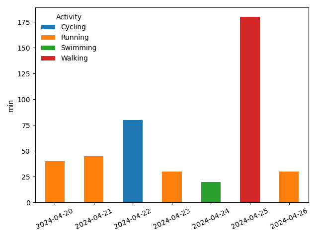

## Documentation

### Python Environment
To start our program you need to have installed python. We suggested to use *Anaconda*, an open-source package and environment management system that runs on Windows, macOS, and Linux. For more information click [here](https://docs.anaconda.com/free/anaconda/install/index.html).

After you installed *Anaconda* you can create a environment. In the terminal type the following command:
<pre> conda create --name my-env </pre>

In this way, you created your own environment. To activate your environment you can type:

<pre> conda activate my-env</pre>

When you have activated you environment, goes in the folder of the repository and type the following command:
<pre> pip install -r requirements.txt </pre>

After that all the necessary packages will be installed in your environment.

### Interface of GymGenie

GymGenie provides two options for the interface: CLI (Command Line Interface) and GUI (Graphical User Interface). You can choose which of the interfaces you prefer to use. How to start and use the two interfaces are described below.

## CLI

### Start the Programm
Go in the folder of the repository and type the following command:
<pre> python .\src\main.py </pre>
If you are using MacOS or Linux the path of the file has to be adjusted.

After starting the program it will appear the menu page of our program.

Have fun exploring our program.

### Functionality

Menu Option:
1. Log Workout - type *w* or click on the workout button
2. Goal - type *g* or click on set a goal
3. See Goals Progress - type *o* or click on see progress option
4. Summary Workouts - type *s* or click on see workouts option
5. Exit - type *q* or click on exit

#### Log Workouts

The option *Log workouts* allows you to enter the data of the workout data you already performed. You will be able to choose between:
- **Running**
- **Cycling**
- **Strength**
- **Swimming**
- **Walking**
- **Skiing**
- **Climbing**
- **Others**

Additionally you suppose to entry the date of the workout with this format *dd/mm/year*, the duration of the exercise in *minutes*, the calories consumed in *kcal* and the rating of your workout from a scale betwenn *1* and *10*. For some activity you will be also asked to entry the distance of your training in *km*.

After the insertion of you last data, you will be asked to check your data before saving it. If you answer *y* then your data will be saved and you will go back to the menu page.

#### Set Goal

The option *Set Goal* allows you to set up a goal that you'd like to reach. You can choose between:
- Goal Duration
- Goal Distance
- Goal Calories

Depending on your choice you will be asked to specify the value that you want to choose. It will automatically create the unit of the goal for you:

| Goal| Unit|
|-----|-----|
|Distance| km|
|Duration| min|
Calories| kcal|

After you can specify the *timeframe* of you goal. You can choose to have a weekly/monthly or yearly goal. In addition you will be able to choose the start and end date of your goal. Finally you will specify in which sports do you want to apply your goal. You will have the option of a specific sport or just to select all the workouts that you do. Depending on this option you will see differents plot.

#### See Goals

The option *See Goals* allows you to see how much progress you did towards your prefixed goal. From the dataframe containing all yours goals you will be asked to choose which goals progress you want to see. Depending on your *Activity* present in you goal you will see two types of plot: Specifically for one exercises or In general.

**Specific**:

 

 From the plot you will see on the *y-axis* the **type** of goal and from the title which **sport**. When there is no data but you see a label of the day it means that you did another type of workout.

**General**

If you select *All** in exercises, you will see a general view of all your activity. The first plot that you will see is the following

This plot will be useful for you to visualize see how much you need to do before reaching your goal. On the *y-axis* you will see the **type** of goal. The value of the goal is marked with a dotted line. After everyday, the partial sum of the total workout that you made from the start of the goal will appear on the top of the bar toghether with the dates.

The second plot you will see instead is a panoramical view of all different workouts that you did so far.

Depending on the differents workout you did, it will be coloured according to the type of sport. If you practice multpliple sport in one day, then you will see a bar with the total amount done and for each sport how much was. if you are training for a ironman you will be able to see in comparison how much from each sport you are training and which sport you are not training as well as the other.

The final plot is called total progress.

This plot will show you in percentage the total sport that you have done and how much you still need to do. If you already reach the goal it will show you more then *100 %* and this means that you are doing more training as you expected. Instead if you still need to reach the goal it will shows you how much you done.

If you would like to see more type of plot, please contact us and we will add the function!

#### Summary Visualisation

We are currently working on it!! Stay tuned!!

#### Exit

If you want to exit the program you can type *q* in the terminal or click exit on the GUI. All your data will be saved and next time you will enter the program you will be able to access all your current data.

## GUI
