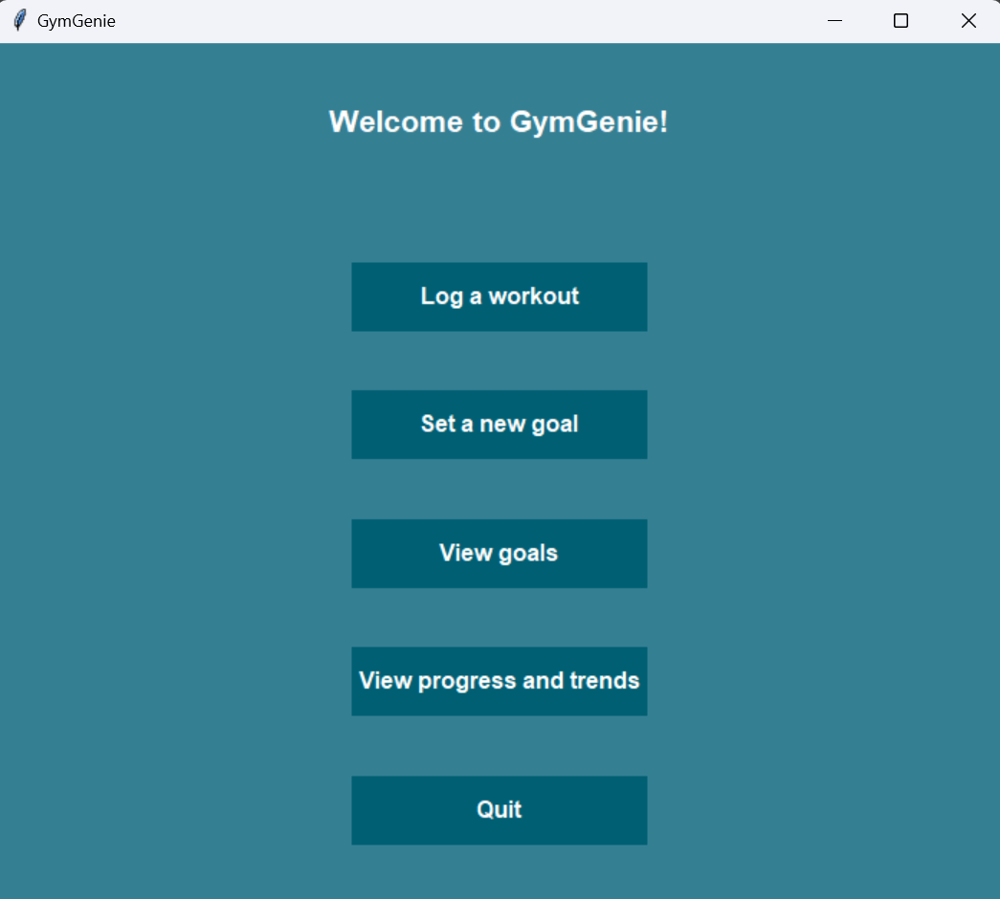
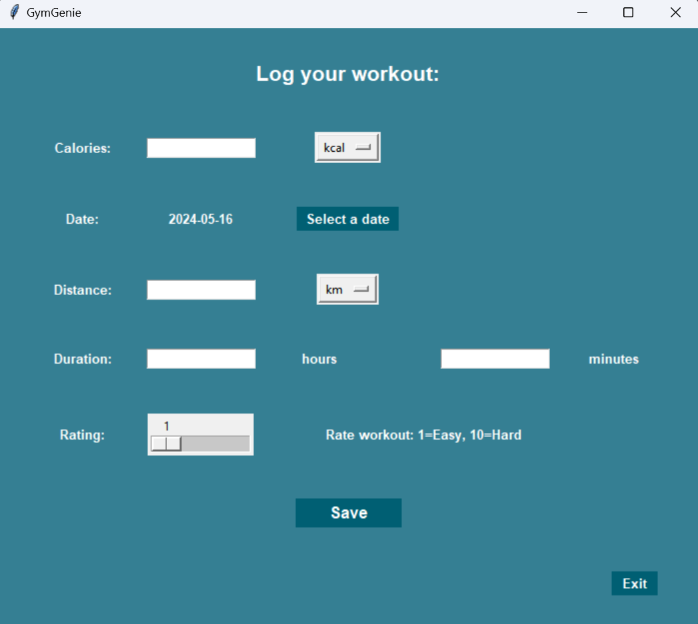
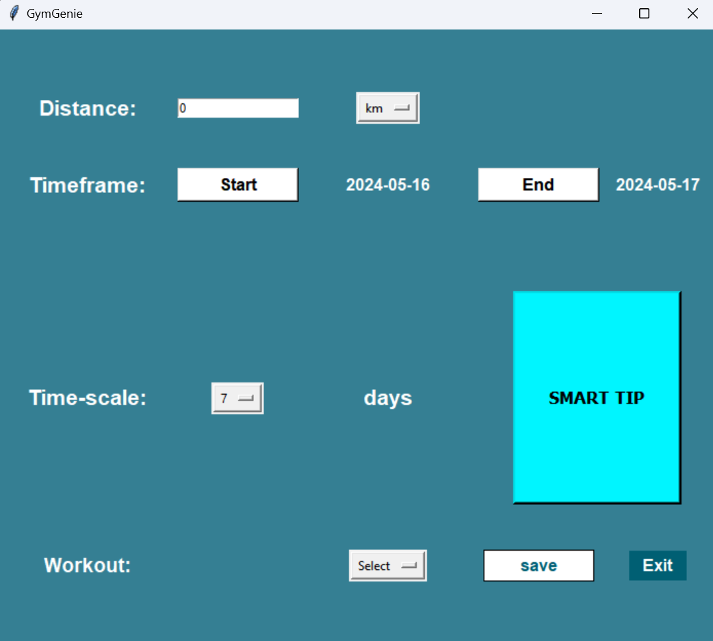
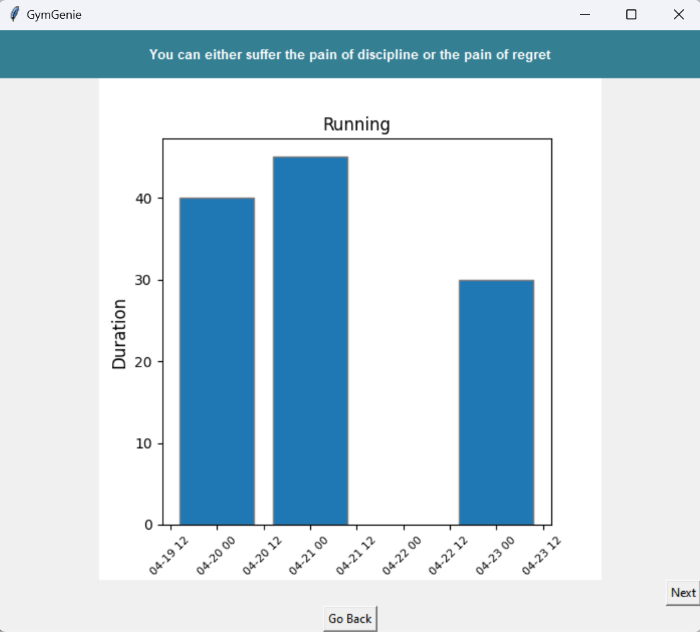
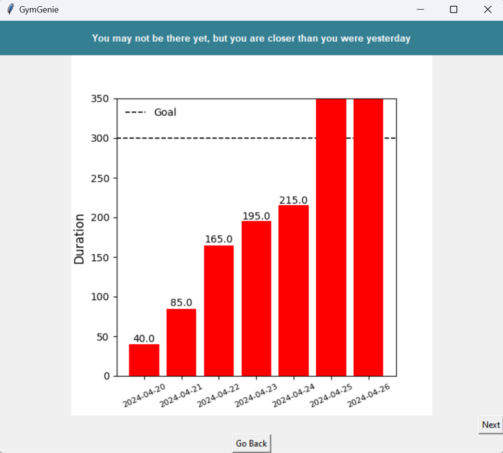
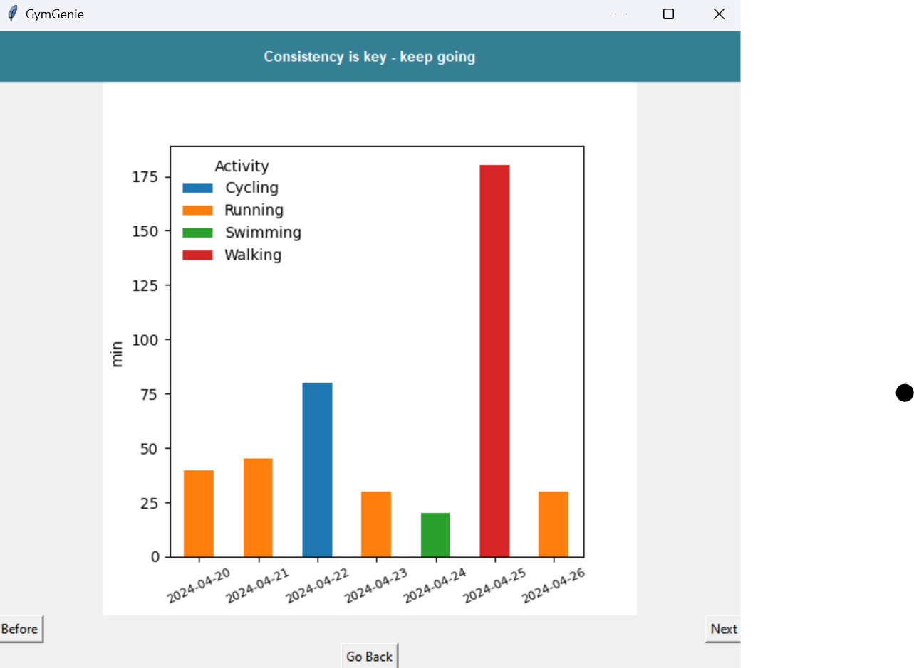
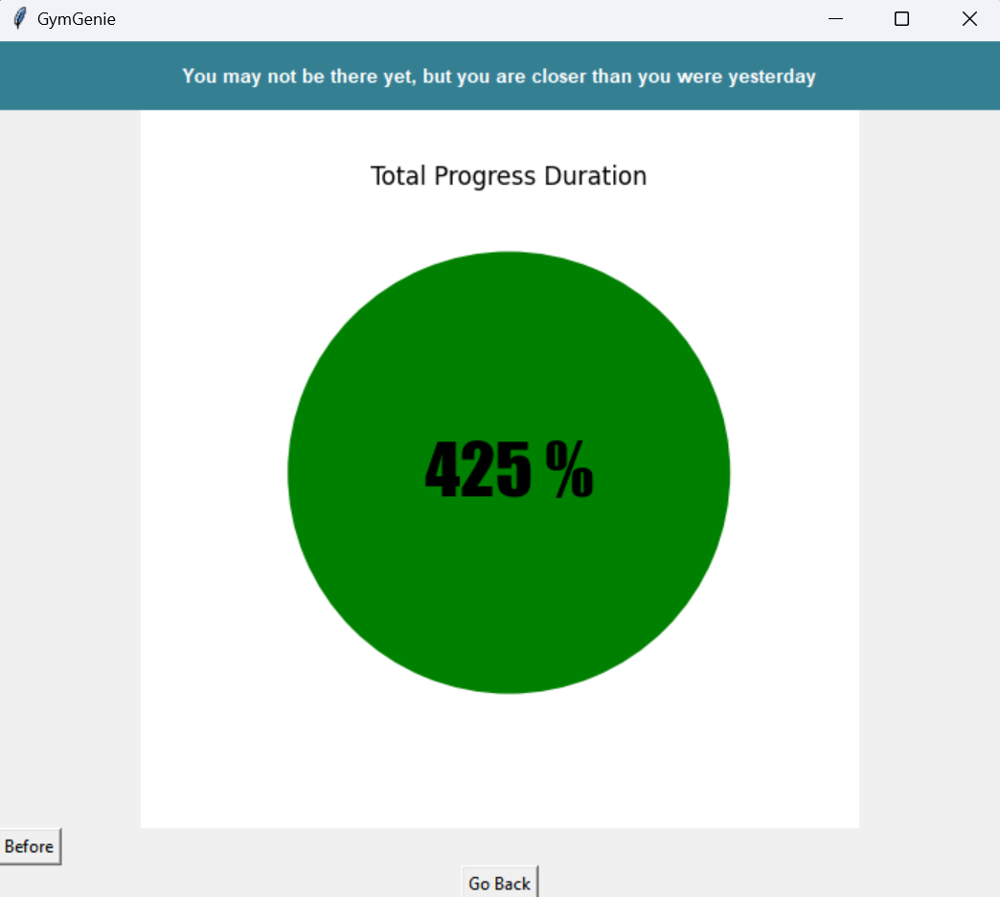

## Documentation

### Python Environment
To start our program you need to have installed python. We suggested to use *Anaconda*, an open-source package and environment management system that runs on Windows, macOS, and Linux. For more information click [here](https://docs.anaconda.com/free/anaconda/install/index.html).

After you installed *Anaconda* you can create a environment. In the terminal type the following command:
<pre> conda create --name my-env </pre>

In this way, you created your own environment. To activate your environment you can type:

<pre> conda activate my-env</pre>

When you have activated you environment, go in the folder of the repository and type the following command:
<pre> pip install -r requirements.txt </pre>

After that all the necessary packages will be installed in your environment.

### Interface of GymGenie

GymGenie provides two options for the interface: CLI (Command Line Interface) and GUI (Graphical User Interface). You can choose which of the interfaces you prefer to use. How to start and use the two interfaces is described below.

## CLI

### Start the Program
Go in the folder of the repository and type the following command:
<pre> python .\src\main.py </pre>
If you are using MacOS or Linux the path of the file has to be adjusted.

After starting the program the menu page of our prgoram will appear.

Have fun exploring our program.

### Functionality

Menu Option:
1. Log Workout - type *w*
2. Goal - type *g*
3. See Goals Progress - type *o*
4. Summary Workouts - type *s*
5. Exit - type *q*

#### Log Workouts

The option *Log workouts* allows you to enter the data of the workout you already performed. You will be able to choose between:
- **Running**
- **Cycling**
- **Strength**
- **Swimming**
- **Walking**
- **Skiing**
- **Climbing**
- **Others**

Additionally you are supposed to enter the date of the workout with this format *dd/mm/year*, the duration of the exercise in *minutes*, the calories burned in *kcal* and the rating of your workout on a scale between *1* and *10*. For some activities you will be also asked to entry the distance of your training in *km*.

After the insertion of your last data, you will be asked to check your data before saving it. If you answer *y* then your data will be saved and you will go back to the menu page.

#### Set Goal

The option *Set Goal* allows you to set up a goal that you'd like to reach. You can choose between:
- Goal Duration
- Goal Distance
- Goal Calories

Depending on your choice you will be asked to specify the value that you want to choose. It will automatically create the unit of the goal for you:

| Goal| Unit|
|-----|-----|
|Distance| km|
|Duration| min|
Calories| kcal|

After you can specify the *timeframe* of you goal. You can choose to have a weekly/monthly or yearly goal, for example a weekly goal would mean you want to run 10 km each week. In addition you will be able to choose the start and end date of your goal. Finally you will specify in which sports you want to apply your goal. You will have the option of a specific sport or just to select all the workouts that you do. Depending on this option you will see different plots.

#### See Goals

The option *See Goals* allows you to see how much progress you did towards your prefixed goal. From the dataframe containing all your goals, you will be asked to choose towards which goal you want to see the progress. Depending on the *Activity* defined in your goal you will see two types of plots: Specifically for one exercise or In general.

**Specific**:

 

 From the plot you will see on the *y-axis* the **type** of goal and from the title which **sport**. When there is no data but you see a label of the day it means that you did another type of workout.

**General**

If you select *All** in exercises, you will see a general view of all your activity. The first plot that you will see is the following

This plot will be useful for you to visualize how much is left to do before reaching your goal. On the *y-axis* you will see the **type** of goal. The value of the goal is marked with a dotted line. After every day, the partial sum of the total workout that you made from the start of the goal will appear on the top of the bar toghether with the dates.

The second plot you will see is a panoramical view of all different workouts that you did so far.

Depending on the different workouts you did, it will be coloured according to the type of sport. If you practice multiple sports in one day, then you will see a bar with the total amount done and how much you did for each sport. Of you are training for an ironman you will be able to see in comparison how much from each sport you are training and which sport you are not training as much as the others.

The final plot is called total progress.

This plot will show you in percentage how far you are towards achieving your goal. If you already reached the goal, it will show you more than *100 %* and this means that you are doing more training than you expected. Instead, if you still need to reach the goal, it will show you how much you have done so far.

If you would like to see more types of plots, please contact us and we will add the function!

#### Summary Visualisation

We are currently working on it!! Stay tuned!!

#### Exit

If you want to exit the program you can type *q* in the terminal or click exit on the GUI. All your data will be saved and next time you will enter the program you will be able to access all your current data.

## GUI

### Start the Program
Go in the folder of the repository and type the following command:
<pre> python .\src\mainGUI.py </pre>
If you are using MacOS or Linux the path of the file has to be adjusted.

After starting the program the start page of GymGenie will appear.

Have fun exploring our program.

### Functionality

Menu Option:
1. Log a workout - click on the log a workout button
2. Set a new goal - click on the set a new goal button
3. View goals - click on the view goals button
4. View progress and trends - click on the view progress and trends button
5. Quit - click on quit

#### Log a Workout

The option *Log a workout* allows you to enter the data of the workout data you already performed. You will be able to choose between:
- **Running**
- **Cycling**
- **Strength**
- **Swimming**
- **Walking**
- **Skiing**
- **Climbing**
- **Others**

For the each workout type you can enter the date of the workout, the duration of the exercise in *hours* and *minutes*, the calories consumed in *kcal* or *kJ* and the rating of your workout on a scale between *1* and *10*. For some activities, you will also be asked to enter the distance of your training in *km*, *m* or *miles*.

#### Set a New Goal

The option *Set Goal* allows you to set up a goal that you'd like to reach. You can choose between:
- Goal Duration
- Goal Distance
- Goal Calories

Depending on your choice you will be asked to specify the goal you want to set and which unit you want to use for the goal. After that, you can specify the *timeframe* of your goal. You can choose the start and end date of the goal and if you want to to have a weekly/monthly or yearly goal. Finally you will specify in which sports you want to apply your goal. You will have the option of a specific sport or just to select all the workouts that you do. Depending on this option, you will see different plots when viewing the goals. On this page, you can also click the button "SMART TIP" if you want to have a tip for how you should set your goals.

#### View Goals

The option *View Goals* allows you to see how much progress you did towards your prefixed goal. From the dataframe containing all your goals, you will be asked to choose towards which goal you want to see the progress. Depending on the *Activity* defined in your goal, you will see two types of plot: Specifically for one exercise or In general.

**Specific**:

 

 From the plot you will see on the *y-axis* the **type** of goal and from the title which **sport**. When there is no data but you see a label of the day, it means that you did another type of workout.

**General:**

If you select *All** in exercises, you will see a general view of all your activity. The first plot that you will see is the following

This plot will be useful for you to visualize how much you need to do before reaching your goal. On the *y-axis* you will see the **type** of goal. The value of the goal is marked with a dotted line. After every day, the partial sum of the total workout that you made from the start of the goal will appear on the top of the bar toghether with the dates.

The second plot you will see if you choose *All** in exercises is a panoramical view of all different workouts that you did so far.

Depending on the different workouts you did, it will be coloured according to the type of sport. If you practice multiple sports in one day, then you will see a bar with the total amount done and how much you did for each sport. If you are training for an ironman, you will be able to see in comparison how much from each sport you are training and which sport you are not training as much as the others.

The final plot is called total progress and is shown both if you choose *All** or a specific type of exercise.

This plot will show you in percentage the total sport that you have done and how much you still need to do. If you already reached the goal, it will show you more then *100 %* and this means that you are doing more training than you expected. Instead if you still need to reach the goal, it will show you how much you have done so far.

If you would like to see more types of plots, please contact us and we will add the function!

#### View Progress and Trends

We are currently working on it. Stay tuned!

#### Quit

If you want to quit the program you can click quit on the GUI. All your data will be saved and next time you will enter the program, you will be able to access all your current data.
